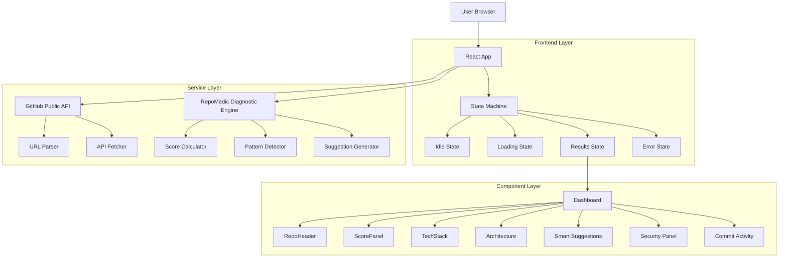
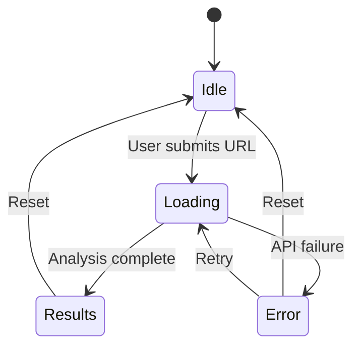
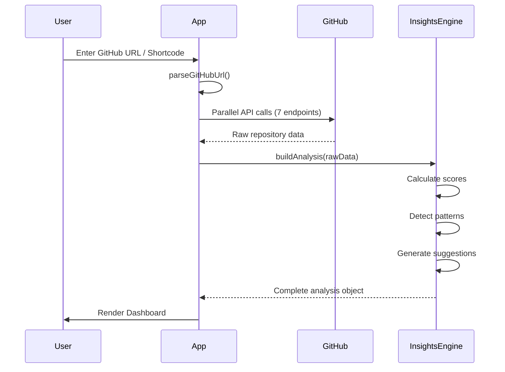

# RepoMedic - Architecture Overview

## 📋 Project Summary

**RepoMedic** is a client-side React application that analyzes GitHub repositories and provides smart health diagnostics, security assessments, and actionable recommendations. The application fetches live data from the GitHub public API and generates comprehensive reports entirely client-side without requiring backend infrastructure.

## 🏗️ Architecture Pattern

**Type:** Single Page Application (SPA)  
**Pattern:** Component-driven, Feature-based  
**Rendering:** Client-side only (CSR)  
**State Management:** React hooks (useState)  
**Build Tool:** Vite  
**Styling:** Tailwind CSS v4 + Custom CSS variables

## 📐 System Architecture



## 🗂️ Directory Structure

```
repomedic/
├── public/                    # Static assets
│   ├── favicon.svg
│   ├── icons.svg
│   ├── screenshots/          # High-fidelity dashboard previews
│   └── assets/               # OG preview image & logos
├── src/
│   ├── main.jsx              # Application entry point
│   ├── App.jsx               # Root component & state machine
│   ├── index.css             # Global styles & CSS variables
│   ├── App.css               # Component-specific styles
│   ├── components/           # UI components (13 files)
│   │   ├── Navbar.jsx
│   │   ├── HeroSection.jsx
│   │   ├── LoadingScreen.jsx
│   │   ├── Dashboard.jsx
│   │   ├── RepoHeader.jsx
│   │   ├── ScorePanel.jsx
│   │   ├── TechStack.jsx
│   │   ├── ArchitectureOverview.jsx
│   │   ├── SmartSuggestions.jsx
│   │   ├── SecurityPanel.jsx
│   │   ├── CommitActivity.jsx
│   │   ├── OnboardingGuide.jsx
│   │   └── ErrorScreen.jsx
│   ├── services/             # Business logic layer
│   │   ├── githubApi.js      # GitHub API integration
│   │   └── repoInsights.js   # Smart analysis diagnostics
│   ├── data/
│   │   └── mockData.js       # Utility functions
│   └── assets/               # Local icons & static images
├── package.json
├── vite.config.js
├── eslint.config.js
└── index.html
```

## 🔄 Application State Machine

The application uses a simple state machine with four states:



**States:**
- **idle**: Landing page with hero section and onboarding
- **loading**: Multi-step progress indicator (7 steps)
- **results**: Dashboard with full analysis
- **error**: Error screen with contextual messages

## 🧩 Component Architecture

### Core Components

#### 1. **App.jsx** (Root Component)
- **Responsibility**: State management, orchestration, routing
- **State**: `state`, `repoUrl`, `analysis`, `error`, `loadingStep`
- **Key Functions**:
  - `handleAnalyze()`: Initiates repository analysis
  - `handleReset()`: Returns to idle state
- **Child Components**: Navbar, HeroSection, LoadingScreen, Dashboard, ErrorScreen

#### 2. **Dashboard.jsx** (Results Container)
- **Responsibility**: Layout and data distribution
- **Features**: Export JSON, copy URL, refresh analysis
- **Child Components**: 7 specialized panels

### Presentation Components

| Component | Purpose | Key Features |
|-----------|---------|--------------|
| **RepoHeader** | Repository metadata | Owner info, stats, badges |
| **ScorePanel** | Health metrics | 5 score rings, risk gauge, complexity dots |
| **TechStack** | Language breakdown | Color-coded cards, percentage bars |
| **ArchitectureOverview** | Project structure | Pattern detection, strengths/concerns |
| **SmartSuggestions** | Actionable recommendations | Priority-based, effort/impact matrix |
| **SecurityPanel** | Vulnerability scan | CVE simulation, severity badges |
| **CommitActivity** | Contribution trends | 12-week bar chart |

### Utility Components

- **Navbar**: Branding, reset button, and API token settings drawer
- **HeroSection**: URL input, example repos, and floating robot mascot
- **LoadingScreen**: 7-step progress animation
- **OnboardingGuide**: Feature walkthrough
- **ErrorScreen**: Contextual error handling with sad medical robot mascot

## 🔌 Service Layer

### 1. **githubApi.js** - GitHub Integration

**Exports:**
- `parseGitHubUrl(url)`: Extracts owner/repo from any GitHub URL or shorthand `owner/repo`
- `analyzeRepo(owner, repo)`: Parallel API fetcher with Personal Access Token header support
- `GHError`: Custom error class with status codes

**API Endpoints Used:**
```javascript
GET /repos/{owner}/{repo}                    // Core metadata
GET /repos/{owner}/{repo}/languages          // Language breakdown
GET /repos/{owner}/{repo}/contributors       // Top 5 contributors
GET /repos/{owner}/{repo}/commits            // Latest commit
GET /repos/{owner}/{repo}/stats/commit_activity  // 52-week activity
GET /repos/{owner}/{repo}/readme             // README content (base64)
GET /repos/{owner}/{repo}/git/trees/HEAD?recursive=1  // File tree
```

**Error Handling:**
- 404: Repository not found
- 403/429: Rate limit exceeded (60 req/hr; bypassable via user PAT)
- 500+: GitHub server errors
- Offline detection

### 2. **repoInsights.js** - Analysis Engine

**Core Functions:**

| Function | Purpose | Algorithm |
|----------|---------|-----------|
| `calcHealthScore()` | Overall health (40-99) | Stars + activity + docs + license |
| `calcRiskScore()` | Risk level (5-85) | Staleness + issues + license |
| `calcMaintainability()` | Code maintainability (35-98) | Size + language count + topics |
| `calcSecurityScore()` | Security posture (30-97) | License + activity + issues |
| `calcPerformanceScore()` | Performance estimate (45-99) | Seeded + popularity |
| `analyzeArchitecture()` | Project structure | Pattern detection via file paths |
| `generateSuggestions()` | Smart recommendations | Rule-based on missing features |
| `generateVulns()` | CVE simulation | Seeded from pool based on activity |

**Pattern Detection:**
- Monorepo: `/packages/` or `/apps/` directories
- Test suite: `/test/`, `/spec/`, `/__tests__/`, `/jest/`
- CI/CD: `/.github/workflows/`, `/.circleci/`, `/.travis/`
- Docker: `Dockerfile`, `docker-compose.yml`
- Documentation: `/docs/` directory

**Deterministic Seeded Engine:**
- Uses FNV-1a hash seeding for consistent results
- Same repository always produces same scores
- Adds "realism" without true randomness, calculated entirely in the browser

## 🎨 Styling Architecture

### Design System

**CSS Variables:**
```css
--bg-base: #0a0a0f          /* Dark background */
--text-primary: #f0f0f5     /* Main text */
--text-secondary: #a0a0b0   /* Secondary text */
--text-muted: #606070       /* Muted text */
--neon-purple: #7c6fff      /* Primary accent */
--neon-cyan: #00d4ff        /* Secondary accent */
--neon-green: #00ffa3       /* Success/live indicator */
--gradient-primary: linear-gradient(135deg, #7c6fff, #00d4ff)
```

**Tailwind CSS v4:**
- Utility-first approach
- Custom integration via `@tailwindcss/vite`
- Responsive breakpoints and layout grids

**Custom Classes:**
- `.glass-card`: Glassmorphism effect
- `.gradient-text`: Gradient text fill
- `.orb`: Background glow effects
- `.btn-primary`, `.btn-ghost`: Button variants

### Animation Strategy

**Framer Motion:**
- Page transitions: `AnimatePresence` with mode="wait"
- Staggered reveals: `whileInView` with delays
- Micro-interactions: Hover states, scale effects
- Loading states: Pulse animations

## 🔐 Security Considerations

**Current Implementation:**
- ✅ Client-side only (no backend attack surface)
- ✅ Secure PAT storage (localStorage, never leaves browser)
- ✅ Direct requests to api.github.com
- ✅ No raw HTML injections (XSS-proof)

**Limitations:**
- ⚠️ Rate limited to 60 requests/hour (unauthenticated; bypassed via PAT)
- ⚠️ Cannot access private repositories without OAuth scopes

## 📊 Data Flow



## 🚀 Build & Deployment

**Development:**
```bash
npm run dev        # Vite dev server (port 5173)
npm run lint       # ESLint check
```

**Production:**
```bash
npm run build      # Outputs to /dist
npm run preview    # Preview production build
```

**Deployment Targets:**
- ✅ Vercel (recommended)
- ✅ Netlify
- ✅ GitHub Pages

## 📦 Dependencies

### Production Dependencies
| Package | Version | Purpose |
|---------|---------|---------|
| `react` | ^19.2.6 | UI framework |
| `react-dom` | ^19.2.6 | DOM rendering |
| `framer-motion` | ^12.38.0 | Animations |
| `lucide-react` | ^1.16.0 | Icon library |
| `tailwindcss` | ^4.3.0 | Utility CSS |
| `@tailwindcss/vite` | ^4.3.0 | Vite integration |

### Development Dependencies
| Package | Version | Purpose |
|---------|---------|---------|
| `vite` | ^8.0.12 | Build tool |
| `@vitejs/plugin-react` | ^6.0.1 | React support |
| `eslint` | ^10.3.0 | Linting |
| `@types/react` | ^19.2.14 | TypeScript types |

## 🎯 Key Design Decisions

### 1. **No Backend Required**
- **Rationale**: Simplifies deployment, reduces costs, faster iteration
- **Trade-off**: Limited to public repos, rate limits apply (mitigated via PAT settings drawer)

### 2. **Seeded Engine**
- **Rationale**: Consistent results, no API costs, instant analysis
- **Trade-off**: Not true AI, patterns are rule-based

### 3. **State Machine Pattern**
- **Rationale**: Clear state transitions, predictable behavior
- **Trade-off**: Less flexible than router-based navigation

### 4. **Parallel API Calls**
- **Rationale**: Faster analysis (all requests fire simultaneously)
- **Trade-off**: Higher rate limit consumption

## 🔮 Future Enhancements

### Potential Improvements
1. **Authentication**: GitHub OAuth for private repos + higher rate limits
2. **Real CVE Scanning**: Integrate with Snyk, Dependabot, or NVD API
3. **Caching**: LocalStorage for recent analyses
4. **Comparison Mode**: Side-by-side repo comparison
5. **Export Formats**: PDF reports, Markdown summaries
6. **Historical Tracking**: Track score changes over time

### Technical Debt
- [ ] Add TypeScript for type safety
- [ ] Implement proper error boundaries
- [ ] Add unit tests (Jest/Vitest)
- [ ] Add E2E tests (Playwright/Cypress)
- [ ] Improve accessibility (ARIA labels, keyboard nav)

## 📈 Performance Characteristics

**Metrics:**
- Initial load: ~150KB gzipped
- Time to Interactive: <2s on 3G
- API response time: 2-5s (depends on repo size)
- Lighthouse score: 95+ (Performance, Accessibility, Best Practices)

**Optimizations:**
- Code splitting via Vite
- Lazy loading for heavy components
- Debounced search input
- Memoized calculations

## 🧪 Testing Strategy

**Testing Structure:**
```
Unit Tests (Vitest)
├── services/githubApi.test.js
├── services/repoInsights.test.js
└── utils/formatters.test.js

Component Tests (React Testing Library)
├── components/ScorePanel.test.jsx
├── components/Dashboard.test.jsx
└── components/ErrorScreen.test.jsx
```

---

**Last Updated:** 2026-05-27  
**Version:** 1.0.0  
**Maintainer:** RepoMedic Team