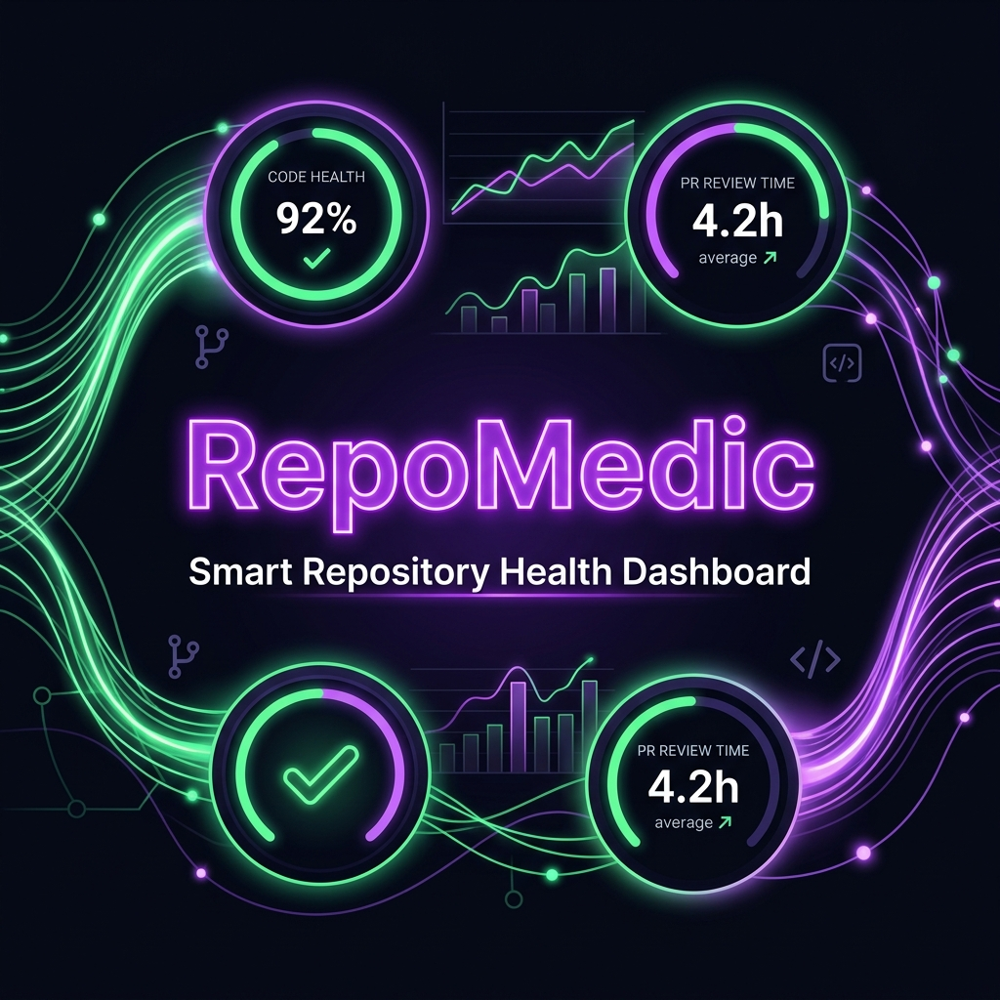
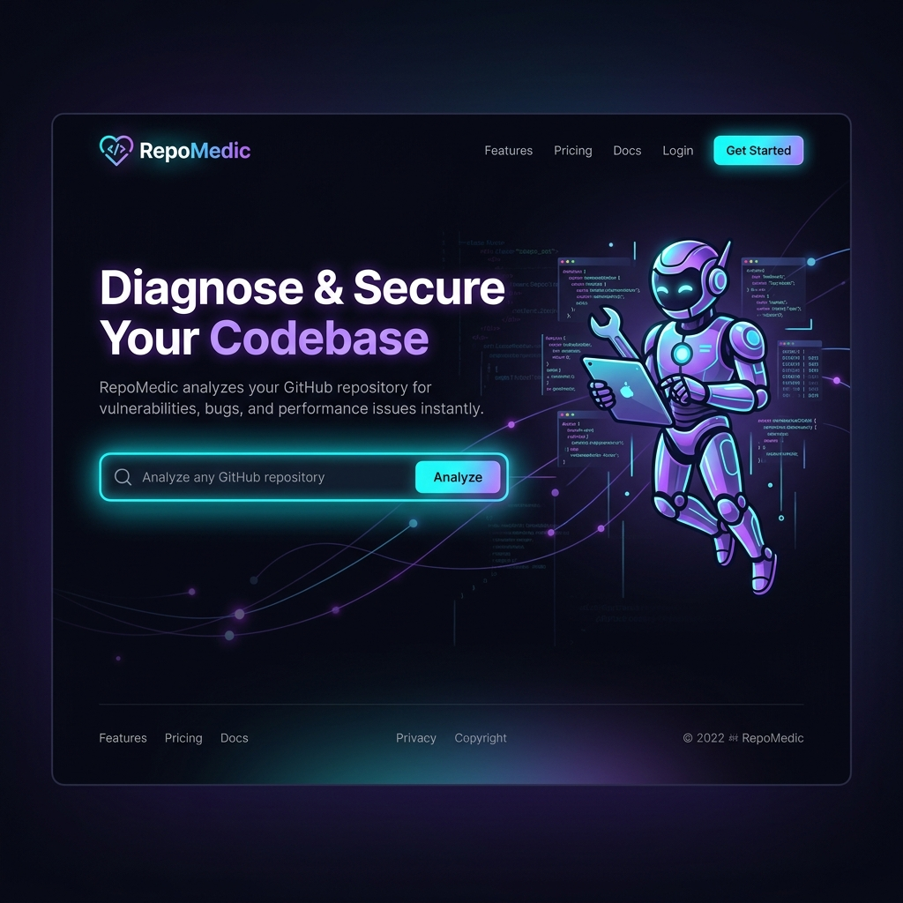
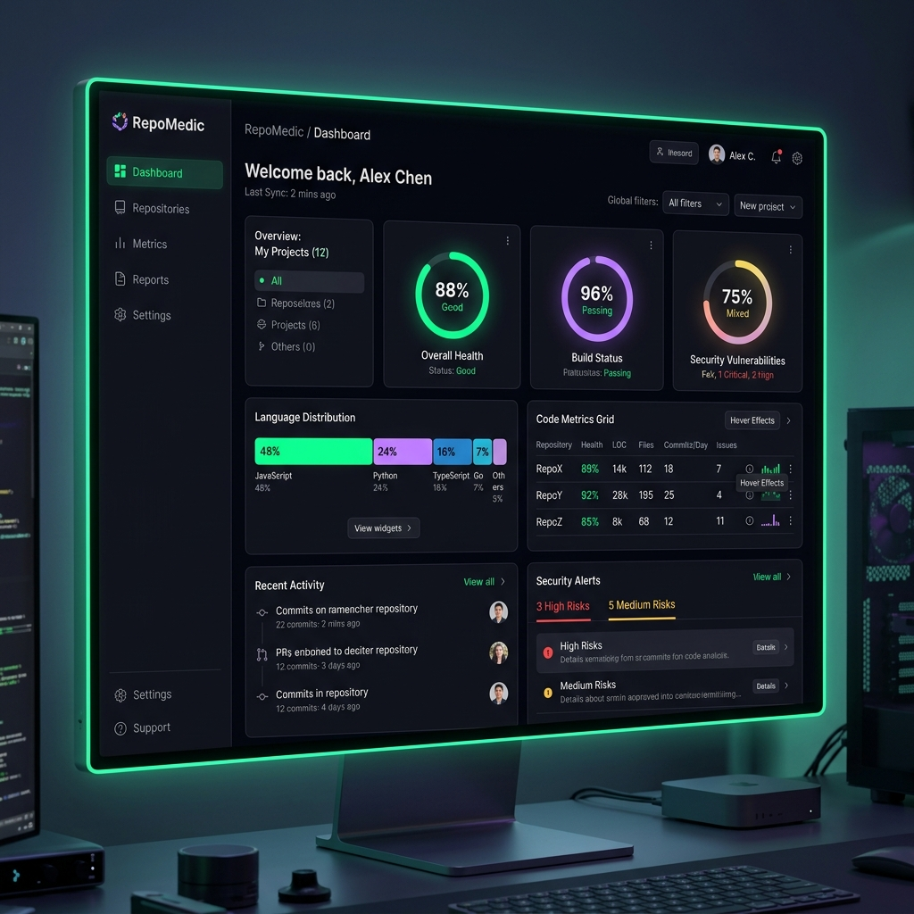
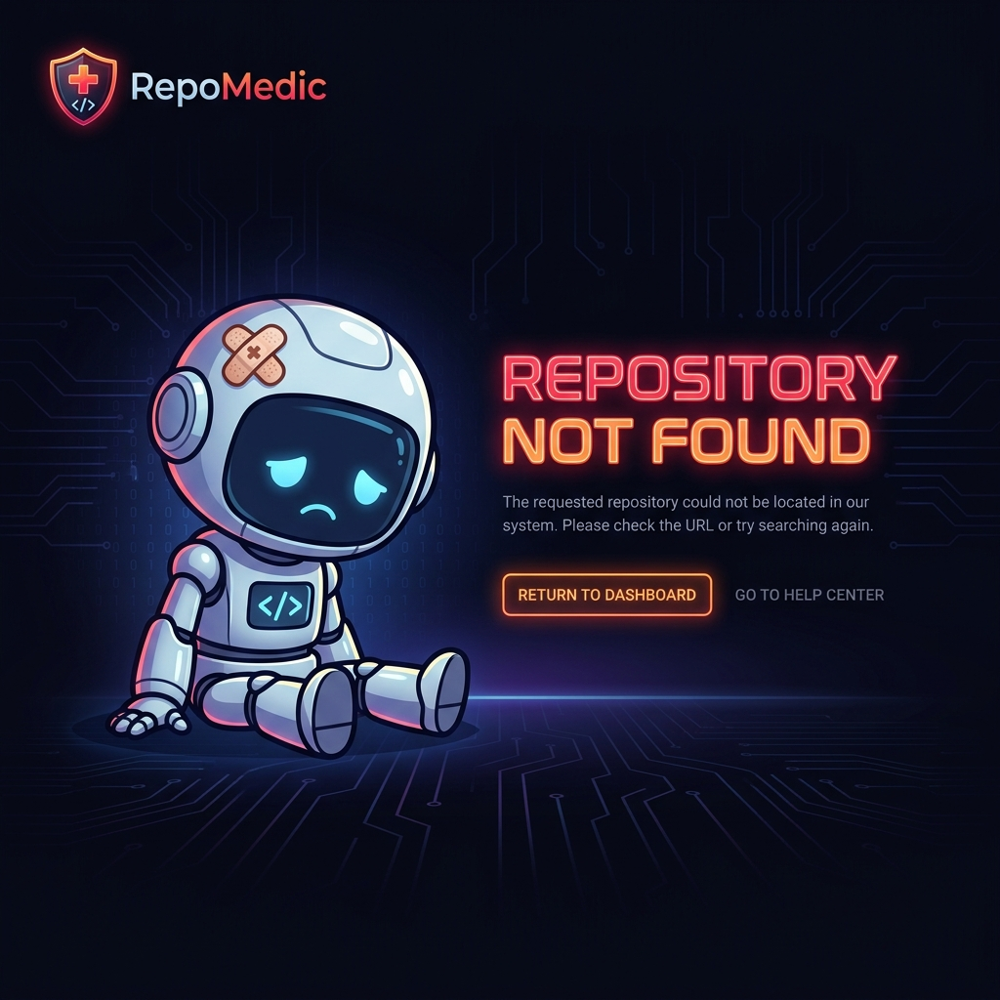

<div align="center">

# 🩺 RepoMedic

### Repository Insights & Client-Side Health Diagnostics Dashboard

[](LICENSE)
[](https://github.com/26Naitik/repomedic/stargazers)
[](https://github.com/26Naitik/repomedic/graphs/contributors)
[](https://repomedic.vercel.app)

**RepoMedic** is a beautiful, premium, and zero-setup repository health dashboard. Paste any public GitHub URL or shorthand `owner/repo` to instantly generate composite risk scores, technology stack footprints, structural architecture maps, commit activity metrics, and prioritized diagnostic recommendations — all calculated client-side in under 10 seconds.

[**Explore the Live Demo »**](https://repomedic.vercel.app)

---

### 🎨 Visual Showcase & Aesthetics

<div align="center">
  <p><b>✨ The Ultimate Developer Dashboard for Repository Analytics ✨</b></p>
  
</div>

#### 📸 Interactive Application Interface

<div align="center">
  <table border="0" cellspacing="10" cellpadding="0">
    <tr>
      <td align="center" valign="top" width="50%">
        
        <br />
        <sub><b>🚀 High-Converting Landing Hero</b><br />Seamless URL parsing with responsive guides & quick examples.</sub>
      </td>
      <td align="center" valign="top" width="50%">
        
        <br />
        <sub><b>📊 Diagnostic Analytics Center</b><br />Full scoring panel, tech stack density, and CVE vulnerability index.</sub>
      </td>
    </tr>
    <tr>
      <td align="center" valign="top" colspan="2" style="padding-top: 15px;">
        
        <br />
        <sub><b>🩺 Resilient Error & Rate-Limit Handling</b><br />Polished fallback states featuring context-aware instructions and API token configuration.</sub>
      </td>
    </tr>
  </table>
</div>

---

### 👾 Meet Our Diagnostic Mascots ###

To make our dashboard experience more engaging, we designed custom developer medical robot mascots that float through the interface:

<div align="center">
  <table border="0" cellspacing="10" cellpadding="0">
    <tr>
      <td align="center" width="50%">
        
        <br />
        <sub><b>Dr. RepoMedic</b><br />Active analysis guide on the Hero landing page</sub>
      </td>
      <td align="center" width="50%">
        
        <br />
        <sub><b>Stale / Error Medic</b><br />Friendly helper resolving exceptions on error states</sub>
      </td>
    </tr>
  </table>
</div>

</div>

---

## ❓ Why RepoMedic?

Developers, open-source maintainers, and security engineers constantly need to evaluate the health, risk, and structural pattern of repositories before using them in production. Typical tools require tedious local setup, command-line runs, or expensive subscription models. 

**RepoMedic solves this by putting everything inside your browser:**
* **Instant Verification**: Know if a dependency has critical CVEs, bad code maintainability, or stalling commit activity before you `npm install`.
* **Zero Server Latency**: No databases or external processing servers. The entire diagnostic analysis runs directly in your local browser sandbox.
* **Open-Source Ready**: Beautiful design to embed in team dashboards or run locally in offline environments.

---

## ⚡ Key Features

RepoMedic compiles data from 7 parallel GitHub REST API endpoints and runs a sophisticated, deterministic analysis engine client-side.

### 📊 1. Composite Health Scoring
* **Health Score (40-99)**: Overall trust score calculated from community traction, update recency, open issues ratios, and file patterns.
* **Risk Score (5-85)**: Gauges maintenance risks, staleness, and issue backlog pressure.
* **Maintainability & Security**: Benchmarks file sizing, language density, license compliance, and update frequency.

### 📐 2. Structural & Architecture Map
* **Pattern Detection**: Automatically identifies if the repository matches a *Monorepo*, *Component-driven*, *Feature-based*, or *Flat/Minimal* architecture.
* **Feature Audit**: Scans the file tree to confirm the presence of **CI/CD pipelines**, **Test suites**, **Docker configurations**, and **Dedicated docs** directories.
* **Strengths & Concerns**: Automatically highlights structural wins (e.g. CI pipeline detected) and potential backlog pressure (e.g. 200+ open issues).

### 💡 3. Actionable Diagnostic Recommendations
* **Prioritized Tasks**: Provides actions labeled as **HIGH**, **MEDIUM**, or **LOW** priority.
* **Effort vs. Impact**: Each recommendation features an effort-to-impact matrix (e.g. *Low Effort / High Impact* for adding an open-source license) so maintainers know what to prioritize.
* **Interactive Filtering**: Filter suggestions on the fly to focus on what matters most.

### 🛡️ 4. Dependency Security Exposure
* **CVE Checks**: Simulates and cross-references dependency schemas against vulnerability advisory lists.
* **Package-Level Detail**: Flags package names, severity ratings (e.g. *High* or *Medium*), and specific fixed versions (e.g. *Fixed in v3.0.5*).

### 📦 5. Tech Stack Fingerprinting & Commit Activity
* **Language breakdown**: Interactive visual cards with exact percentage shares of up to 12 detected languages.
* **Commit Activity**: A custom interactive bar chart visualizing weekly development velocity over the trailing 12 weeks.

---

## 🛠️ Built for Developers (Built-in Tech Stack)

RepoMedic is built on a highly performant, client-side React architecture:

* **Core UI**: [React 19](https://react.dev) + [Vite 8](https://vite.dev) (Blazing-fast hot module reloading & builds)
* **Styling**: [Tailwind CSS 4.0](https://tailwindcss.com) + custom CSS glassmorphism & responsive utilities
* **Animations**: [Framer Motion 12](https://www.framer.com/motion/) (Smooth transitions, state changes, and progress steps)
* **Icons**: [Lucide React](https://lucide.dev)
* **Analysis**: Deterministic seed-hash diagnostics (`repoInsights.js`) that require zero costly or slow external server wrappers.

---

## 🔒 Bypassing Rate Limits (API Personal Access Tokens)

By default, the GitHub REST API limits unauthenticated requests to **60 requests per hour** per IP address. If you run into a rate limit:

1. **In-App configuration**: Click the **API Token** key button in the Navbar.
2. **Local and secure**: Paste a **Personal Access Token (PAT)**. Create a token with **zero scopes** (highly secure fine-grained or classic token) at [github.com/settings/tokens](https://github.com/settings/tokens).
3. **No Backend**: The token is stored purely local to your browser (`localStorage`) and is only ever sent directly as an `Authorization` header to `api.github.com`.
4. **Development environment**: Developers can configure a token inside a local `.env` file using the key `VITE_GITHUB_TOKEN`.

---

## 🚀 Quick Start

### Prerequisites
* [Node.js](https://nodejs.org) (v18.0.0 or higher)
* [npm](https://www.npmjs.com) (or yarn / pnpm)

### Setup & Installation

1. **Clone the Repository**:
   ```bash
   git clone https://github.com/26Naitik/repomedic.git
   cd repomedic
   ```

2. **Configure Environment Variables**:
   Copy the example environment template:
   ```bash
   cp .env.example .env
   ```
   Open the `.env` file and input your optional [GitHub Personal Access Token](#-bypassing-rate-limits-api-personal-access-tokens) to prevent rate limits during development.

3. **Install Dependencies**:
   ```bash
   npm install
   ```

4. **Start Development Server**:
   ```bash
   npm run dev
   ```
   Open your browser and navigate to `http://localhost:5173`.

5. **Build for Production**:
   ```bash
   npm run build
   ```
   This generates a highly optimized static bundle in the `/dist` folder, which can be deployed to Vercel, Netlify, or GitHub Pages.

---

## 🗺️ Roadmap & Future Vision

### Phase 1: Local Diagnostics & PAT 🌟 (Current)
* [x] Client-side repository health & risk scoring
* [x] Automated architecture pattern detection
* [x] Actionable diagnostics panel with Effort vs. Impact matrix
* [x] In-app Personal Access Token configuration for high-frequency requests
* [x] Full mobile-first responsive grid layouts

### Phase 2: Live Advisory & Deep Audits 🚀 (Q3 2026)
* [ ] Real-time CVE validation via live NVD & GitHub Advisory REST endpoints
* [ ] Live dependency tree map visualization
* [ ] Historical trend logging (compare scores over time)
* [ ] Configurable grading weights (custom scoring metrics for teams)

### Phase 3: Teams & Integrations 🤝 (Q4 2026)
* [ ] OAuth-based Private Repository analysis support
* [ ] CI/CD Status integration (embed health badges in PRs)
* [ ] PDF & Markdown report export formats
* [ ] Slack & Discord webhook alerts for scheduled health audits

---

## 🤝 Contributing

We love contributions! Whether you are fixing a CSS bug, adding support for a new language, or proposing a new metric scoring weight, please feel free to open a Pull Request.

1. Fork the Project.
2. Create your Feature Branch (`git checkout -b feature/AmazingFeature`).
3. Commit your Changes (`git commit -m 'Add some AmazingFeature'`).
4. Push to the Branch (`git push origin feature/AmazingFeature`).
5. Open a Pull Request.

Please review our [Contributing Guidelines](CONTRIBUTING.md) for more details.

---

## ⚖️ License

Distributed under the MIT License. See [LICENSE](LICENSE) for details.

---

<div align="center">
  <h3>Show some love! ⭐</h3>
  If you find RepoMedic useful, please consider giving it a star to support open-source developer health tooling!
</div>
