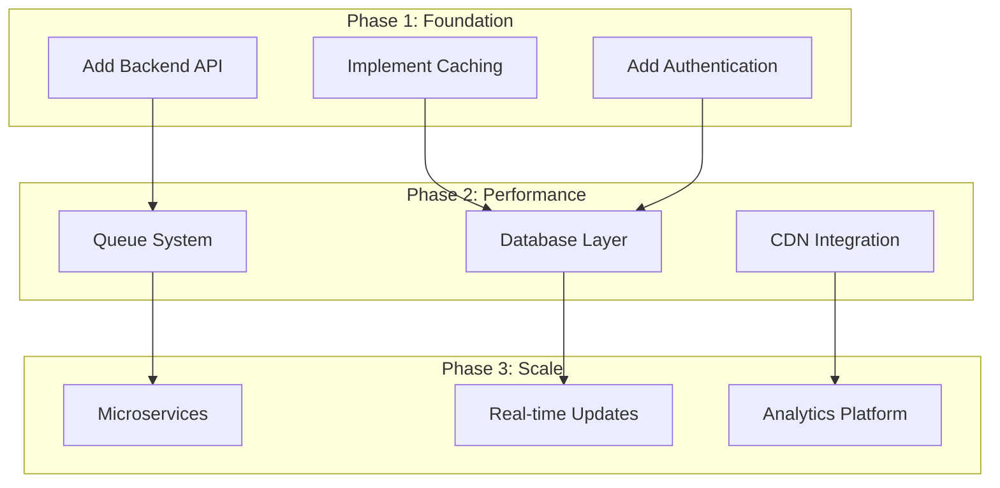

# 🚀 Scalability Improvements for RepoMedic AI

This document outlines strategic improvements to scale RepoMedic AI from a client-side demo to a production-ready platform capable of handling thousands of users and repositories.

## 📊 Current Limitations

### Performance Bottlenecks
- **GitHub API Rate Limits**: 60 requests/hour (unauthenticated), 5,000/hour (authenticated)
- **Client-Side Processing**: All analysis runs in browser, blocking UI
- **No Caching**: Every analysis requires fresh API calls
- **Large Repositories**: File tree fetching can timeout or truncate
- **Sequential User Flow**: One analysis at a time per user

### Scalability Constraints
- **No Data Persistence**: Analysis results lost on page refresh
- **No User Accounts**: Cannot track history or preferences
- **No Batch Processing**: Cannot analyze multiple repos simultaneously
- **No Real-Time Updates**: Cannot monitor repositories over time
- **Limited Analytics**: No usage metrics or insights

## 🎯 Scalability Strategy



## 🏗️ Architecture Evolution

### Current Architecture (Client-Side Only)

```
┌─────────────┐
│   Browser   │
│             │
│  React App  │ ──────► GitHub API (60 req/hr)
│             │
│  Analysis   │
└─────────────┘
```

**Limitations:**
- Rate limits per IP address
- No caching across users
- Heavy client-side computation
- No data persistence

### Proposed Architecture (Hybrid)

```
┌─────────────┐
│   Browser   │
│             │
│  React App  │ ◄──────► Backend API
└─────────────┘           │
                          ├──► Redis Cache
                          ├──► PostgreSQL
                          ├──► Queue (Bull/BullMQ)
                          └──► GitHub API (5000 req/hr)
```

**Benefits:**
- Shared rate limit pool
- Cross-user caching
- Background processing
- Data persistence
- Better error handling

## 📋 Implementation Roadmap

### Phase 1: Backend Foundation (2-3 weeks)

#### 1.1 Backend API Setup

**Technology Stack:**
```javascript
// Recommended: Node.js + Express + TypeScript
Backend:
  - Express.js or Fastify (API server)
  - TypeScript (type safety)
  - Prisma (ORM)
  - PostgreSQL (database)
  - Redis (caching)
  - Bull (job queue)
```

**API Endpoints:**
```
POST   /api/analyze              # Queue new analysis
GET    /api/analysis/:id         # Get analysis results
GET    /api/analysis/:id/status  # Check analysis status
GET    /api/repositories         # List user's analyses
DELETE /api/analysis/:id         # Delete analysis
POST   /api/auth/login           # User authentication
GET    /api/stats                # Platform statistics
```

**Implementation Example:**
```typescript
// backend/src/routes/analyze.ts
import { Router } from 'express';
import { analyzeQueue } from '../queues/analyze';
import { cache } from '../services/cache';

const router = Router();

router.post('/analyze', async (req, res) => {
  const { repoUrl } = req.body;
  const cacheKey = `analysis:${repoUrl}`;
  
  // Check cache first
  const cached = await cache.get(cacheKey);
  if (cached) {
    return res.json({ 
      status: 'completed',
      data: cached 
    });
  }
  
  // Queue for processing
  const job = await analyzeQueue.add('analyze-repo', {
    repoUrl,
    userId: req.user?.id,
    timestamp: Date.now()
  });
  
  res.json({ 
    status: 'queued',
    jobId: job.id,
    estimatedTime: '5-10 seconds'
  });
});

export default router;
```

#### 1.2 Caching Strategy

**Multi-Layer Caching:**

```typescript
// backend/src/services/cache.ts
import Redis from 'ioredis';

const redis = new Redis(process.env.REDIS_URL);

export const cache = {
  // L1: In-memory cache (hot data)
  memory: new Map(),
  
  // L2: Redis cache (shared across instances)
  async get(key: string) {
    // Check memory first
    if (this.memory.has(key)) {
      return this.memory.get(key);
    }
    
    // Check Redis
    const cached = await redis.get(key);
    if (cached) {
      const data = JSON.parse(cached);
      this.memory.set(key, data); // Populate L1
      return data;
    }
    
    return null;
  },
  
  async set(key: string, value: any, ttl = 3600) {
    // Set in both layers
    this.memory.set(key, value);
    await redis.setex(key, ttl, JSON.stringify(value));
  }
};
```

**Cache Invalidation Strategy:**
```typescript
// Cache TTLs by data type
const CACHE_TTL = {
  REPO_METADATA: 3600,      // 1 hour
  ANALYSIS_RESULT: 86400,   // 24 hours
  USER_PROFILE: 1800,       // 30 minutes
  TRENDING_REPOS: 300,      // 5 minutes
};

// Invalidate on webhook events
webhookRouter.post('/github', async (req, res) => {
  const { repository, action } = req.body;
  
  if (action === 'push' || action === 'release') {
    await cache.delete(`analysis:${repository.full_name}`);
  }
});
```

#### 1.3 Database Schema

```sql
-- PostgreSQL Schema
CREATE TABLE users (
  id UUID PRIMARY KEY DEFAULT gen_random_uuid(),
  github_id INTEGER UNIQUE,
  username VARCHAR(255) NOT NULL,
  email VARCHAR(255),
  avatar_url TEXT,
  github_token TEXT, -- Encrypted
  created_at TIMESTAMP DEFAULT NOW(),
  updated_at TIMESTAMP DEFAULT NOW()
);

CREATE TABLE analyses (
  id UUID PRIMARY KEY DEFAULT gen_random_uuid(),
  user_id UUID REFERENCES users(id),
  repo_url TEXT NOT NULL,
  repo_owner VARCHAR(255) NOT NULL,
  repo_name VARCHAR(255) NOT NULL,
  status VARCHAR(50) DEFAULT 'pending', -- pending, processing, completed, failed
  result JSONB, -- Full analysis result
  error_message TEXT,
  processing_time_ms INTEGER,
  created_at TIMESTAMP DEFAULT NOW(),
  completed_at TIMESTAMP,
  INDEX idx_user_analyses (user_id, created_at DESC),
  INDEX idx_repo_lookup (repo_owner, repo_name),
  INDEX idx_status (status)
);

CREATE TABLE analysis_cache (
  id UUID PRIMARY KEY DEFAULT gen_random_uuid(),
  repo_key VARCHAR(255) UNIQUE NOT NULL, -- owner/repo
  data JSONB NOT NULL,
  expires_at TIMESTAMP NOT NULL,
  hit_count INTEGER DEFAULT 0,
  created_at TIMESTAMP DEFAULT NOW(),
  INDEX idx_expiry (expires_at)
);

CREATE TABLE api_usage (
  id UUID PRIMARY KEY DEFAULT gen_random_uuid(),
  user_id UUID REFERENCES users(id),
  endpoint VARCHAR(255) NOT NULL,
  response_time_ms INTEGER,
  status_code INTEGER,
  created_at TIMESTAMP DEFAULT NOW(),
  INDEX idx_user_usage (user_id, created_at DESC)
);
```

### Phase 2: Performance Optimization (3-4 weeks)

#### 2.1 Job Queue System

**Queue Architecture:**
```typescript
// backend/src/queues/analyze.ts
import Queue from 'bull';
import { analyzeRepository } from '../services/github';
import { cache } from '../services/cache';
import { db } from '../services/database';

export const analyzeQueue = new Queue('analyze-repo', {
  redis: process.env.REDIS_URL,
  defaultJobOptions: {
    attempts: 3,
    backoff: {
      type: 'exponential',
      delay: 2000
    },
    removeOnComplete: 100,
    removeOnFail: 50
  }
});

// Worker process
analyzeQueue.process('analyze-repo', 5, async (job) => {
  const { repoUrl, userId } = job.data;
  
  try {
    // Update status
    await db.analyses.update(job.id, { status: 'processing' });
    
    // Perform analysis
    const startTime = Date.now();
    const result = await analyzeRepository(repoUrl);
    const processingTime = Date.now() - startTime;
    
    // Cache result
    await cache.set(`analysis:${repoUrl}`, result, 86400);
    
    // Save to database
    await db.analyses.update(job.id, {
      status: 'completed',
      result,
      processing_time_ms: processingTime,
      completed_at: new Date()
    });
    
    return result;
  } catch (error) {
    await db.analyses.update(job.id, {
      status: 'failed',
      error_message: error.message
    });
    throw error;
  }
});

// Monitor queue health
analyzeQueue.on('completed', (job) => {
  console.log(`Job ${job.id} completed in ${job.finishedOn - job.processedOn}ms`);
});

analyzeQueue.on('failed', (job, err) => {
  console.error(`Job ${job.id} failed:`, err.message);
});
```

**Priority Queue:**
```typescript
// Premium users get priority
const priority = user.isPremium ? 1 : 10;

await analyzeQueue.add('analyze-repo', data, {
  priority,
  jobId: `analysis-${repoUrl}-${Date.now()}`
});
```

#### 2.2 Rate Limit Management

**Token Pool Strategy:**
```typescript
// backend/src/services/rateLimit.ts
import { Redis } from 'ioredis';

class RateLimitManager {
  private redis: Redis;
  private tokens: Map<string, number> = new Map();
  
  constructor() {
    this.redis = new Redis(process.env.REDIS_URL);
    this.initializeTokens();
  }
  
  async initializeTokens() {
    // Load GitHub tokens from database
    const tokens = await db.githubTokens.findMany({
      where: { active: true }
    });
    
    tokens.forEach(token => {
      this.tokens.set(token.id, 5000); // 5000 requests/hour
    });
  }
  
  async acquireToken(): Promise<string> {
    // Find token with available quota
    for (const [tokenId, remaining] of this.tokens.entries()) {
      if (remaining > 100) { // Keep buffer
        this.tokens.set(tokenId, remaining - 1);
        await this.redis.decr(`ratelimit:${tokenId}`);
        return tokenId;
      }
    }
    
    throw new Error('Rate limit exceeded across all tokens');
  }
  
  async releaseToken(tokenId: string) {
    const current = this.tokens.get(tokenId) || 0;
    this.tokens.set(tokenId, current + 1);
  }
  
  // Reset counters every hour
  async resetCounters() {
    for (const tokenId of this.tokens.keys()) {
      this.tokens.set(tokenId, 5000);
      await this.redis.set(`ratelimit:${tokenId}`, 5000);
    }
  }
}

export const rateLimitManager = new RateLimitManager();

// Reset every hour
setInterval(() => rateLimitManager.resetCounters(), 3600000);
```

#### 2.3 Parallel Processing

**Batch Analysis:**
```typescript
// backend/src/services/batch.ts
export async function analyzeBatch(repoUrls: string[]) {
  const chunks = chunkArray(repoUrls, 10); // Process 10 at a time
  
  const results = [];
  for (const chunk of chunks) {
    const promises = chunk.map(url => 
      analyzeQueue.add('analyze-repo', { repoUrl: url })
    );
    
    const chunkResults = await Promise.allSettled(promises);
    results.push(...chunkResults);
    
    // Rate limit breathing room
    await sleep(1000);
  }
  
  return results;
}
```

#### 2.4 CDN Integration

**Static Asset Optimization:**
```typescript
// vite.config.js
export default defineConfig({
  build: {
    rollupOptions: {
      output: {
        manualChunks: {
          'vendor': ['react', 'react-dom'],
          'animations': ['framer-motion'],
          'icons': ['lucide-react']
        }
      }
    }
  },
  // Upload to CDN after build
  plugins: [
    {
      name: 'cdn-upload',
      closeBundle: async () => {
        await uploadToCloudflare('./dist');
      }
    }
  ]
});
```

### Phase 3: Advanced Features (4-6 weeks)

#### 3.1 Real-Time Updates

**WebSocket Integration:**
```typescript
// backend/src/websocket/server.ts
import { Server } from 'socket.io';

export function setupWebSocket(httpServer) {
  const io = new Server(httpServer, {
    cors: { origin: process.env.FRONTEND_URL }
  });
  
  io.on('connection', (socket) => {
    console.log('Client connected:', socket.id);
    
    // Subscribe to analysis updates
    socket.on('subscribe:analysis', (analysisId) => {
      socket.join(`analysis:${analysisId}`);
    });
    
    // Unsubscribe
    socket.on('unsubscribe:analysis', (analysisId) => {
      socket.leave(`analysis:${analysisId}`);
    });
  });
  
  return io;
}

// Emit updates from queue worker
analyzeQueue.on('progress', (job, progress) => {
  io.to(`analysis:${job.id}`).emit('analysis:progress', {
    jobId: job.id,
    progress,
    step: progress.step
  });
});

analyzeQueue.on('completed', (job, result) => {
  io.to(`analysis:${job.id}`).emit('analysis:completed', {
    jobId: job.id,
    result
  });
});
```

**Frontend Integration:**
```typescript
// src/hooks/useRealtimeAnalysis.ts
import { useEffect, useState } from 'react';
import { io } from 'socket.io-client';

export function useRealtimeAnalysis(analysisId: string) {
  const [progress, setProgress] = useState(0);
  const [result, setResult] = useState(null);
  
  useEffect(() => {
    const socket = io(process.env.VITE_WS_URL);
    
    socket.emit('subscribe:analysis', analysisId);
    
    socket.on('analysis:progress', (data) => {
      setProgress(data.progress);
    });
    
    socket.on('analysis:completed', (data) => {
      setResult(data.result);
    });
    
    return () => {
      socket.emit('unsubscribe:analysis', analysisId);
      socket.disconnect();
    };
  }, [analysisId]);
  
  return { progress, result };
}
```

#### 3.2 Microservices Architecture

**Service Decomposition:**
```
┌─────────────────────────────────────────────────────┐
│                   API Gateway                        │
│              (Kong / Nginx / Traefik)               │
└─────────────────────────────────────────────────────┘
           │              │              │
    ┌──────┴──────┐ ┌────┴────┐ ┌──────┴──────┐
    │   Auth      │ │ Analysis│ │   GitHub    │
    │  Service    │ │ Service │ │   Service   │
    └─────────────┘ └──────────┘ └─────────────┘
           │              │              │
    ┌──────┴──────────────┴──────────────┴──────┐
    │           Message Queue (RabbitMQ)         │
    └────────────────────────────────────────────┘
```

**Service Communication:**
```typescript
// services/analysis/src/index.ts
import { EventEmitter } from 'events';
import amqp from 'amqplib';

class AnalysisService extends EventEmitter {
  private channel: amqp.Channel;
  
  async initialize() {
    const connection = await amqp.connect(process.env.RABBITMQ_URL);
    this.channel = await connection.createChannel();
    
    await this.channel.assertQueue('analysis.requests');
    await this.channel.assertQueue('analysis.results');
    
    this.consumeRequests();
  }
  
  async consumeRequests() {
    this.channel.consume('analysis.requests', async (msg) => {
      const { repoUrl, userId } = JSON.parse(msg.content.toString());
      
      try {
        const result = await this.analyze(repoUrl);
        
        // Publish result
        this.channel.sendToQueue(
          'analysis.results',
          Buffer.from(JSON.stringify({ userId, result }))
        );
        
        this.channel.ack(msg);
      } catch (error) {
        this.channel.nack(msg, false, true); // Requeue
      }
    });
  }
  
  async analyze(repoUrl: string) {
    // Analysis logic here
  }
}
```

#### 3.3 Analytics & Monitoring

**Metrics Collection:**
```typescript
// backend/src/middleware/metrics.ts
import { Counter, Histogram, Registry } from 'prom-client';

const register = new Registry();

const httpRequestDuration = new Histogram({
  name: 'http_request_duration_seconds',
  help: 'Duration of HTTP requests in seconds',
  labelNames: ['method', 'route', 'status_code'],
  registers: [register]
});

const analysisCounter = new Counter({
  name: 'analyses_total',
  help: 'Total number of analyses performed',
  labelNames: ['status'],
  registers: [register]
});

export function metricsMiddleware(req, res, next) {
  const start = Date.now();
  
  res.on('finish', () => {
    const duration = (Date.now() - start) / 1000;
    httpRequestDuration
      .labels(req.method, req.route?.path || req.path, res.statusCode)
      .observe(duration);
  });
  
  next();
}

// Expose metrics endpoint
app.get('/metrics', async (req, res) => {
  res.set('Content-Type', register.contentType);
  res.end(await register.metrics());
});
```

**Dashboard Integration:**
```yaml
# docker-compose.yml
services:
  prometheus:
    image: prom/prometheus
    volumes:
      - ./prometheus.yml:/etc/prometheus/prometheus.yml
    ports:
      - "9090:9090"
  
  grafana:
    image: grafana/grafana
    ports:
      - "3000:3000"
    environment:
      - GF_SECURITY_ADMIN_PASSWORD=admin
```

## 📈 Performance Targets

### Current Performance
- Analysis time: 5-10 seconds
- Concurrent users: ~10
- Requests/hour: 60 (unauthenticated)
- Cache hit rate: 0%

### Target Performance (After Optimization)

| Metric | Current | Target | Improvement |
|--------|---------|--------|-------------|
| **Analysis Time** | 5-10s | 2-3s | 60% faster |
| **Concurrent Users** | 10 | 1,000+ | 100x |
| **Requests/Hour** | 60 | 50,000+ | 833x |
| **Cache Hit Rate** | 0% | 80%+ | ∞ |
| **API Response Time** | N/A | <100ms | New |
| **Uptime** | N/A | 99.9% | New |

## 💰 Cost Estimation

### Infrastructure Costs (Monthly)

**Small Scale (1,000 users):**
```
Backend Server (2 vCPU, 4GB RAM)    $20
PostgreSQL (Managed)                 $15
Redis (Managed)                      $10
CDN (Cloudflare)                     $0 (Free tier)
GitHub API (5 tokens)                $0 (Free)
Total:                               $45/month
```

**Medium Scale (10,000 users):**
```
Backend Servers (3x 4 vCPU, 8GB)    $180
PostgreSQL (Managed, HA)             $50
Redis (Managed, HA)                  $30
CDN (Cloudflare Pro)                 $20
Queue Workers (2x 2 vCPU)            $40
Monitoring (Datadog/New Relic)       $50
Total:                               $370/month
```

**Large Scale (100,000 users):**
```
Backend Cluster (Auto-scaling)       $800
Database (Multi-region)              $300
Redis Cluster                        $150
CDN (Enterprise)                     $100
Queue Workers (10x)                  $200
Monitoring & Logging                 $200
Total:                               $1,750/month
```

## 🔒 Security Enhancements

### Authentication & Authorization
```typescript
// JWT-based authentication
import jwt from 'jsonwebtoken';

export function generateToken(user: User) {
  return jwt.sign(
    { 
      id: user.id, 
      role: user.role 
    },
    process.env.JWT_SECRET,
    { expiresIn: '7d' }
  );
}

export function authMiddleware(req, res, next) {
  const token = req.headers.authorization?.split(' ')[1];
  
  if (!token) {
    return res.status(401).json({ error: 'Unauthorized' });
  }
  
  try {
    const decoded = jwt.verify(token, process.env.JWT_SECRET);
    req.user = decoded;
    next();
  } catch (error) {
    res.status(401).json({ error: 'Invalid token' });
  }
}
```

### Rate Limiting (Per User)
```typescript
import rateLimit from 'express-rate-limit';

const limiter = rateLimit({
  windowMs: 15 * 60 * 1000, // 15 minutes
  max: 100, // 100 requests per window
  keyGenerator: (req) => req.user?.id || req.ip,
  handler: (req, res) => {
    res.status(429).json({
      error: 'Too many requests',
      retryAfter: req.rateLimit.resetTime
    });
  }
});

app.use('/api/', limiter);
```

## 🚀 Deployment Strategy

### Containerization
```dockerfile
# Dockerfile
FROM node:20-alpine AS builder
WORKDIR /app
COPY package*.json ./
RUN npm ci
COPY . .
RUN npm run build

FROM node:20-alpine
WORKDIR /app
COPY --from=builder /app/dist ./dist
COPY --from=builder /app/node_modules ./node_modules
EXPOSE 3000
CMD ["node", "dist/index.js"]
```

### Kubernetes Deployment
```yaml
# k8s/deployment.yaml
apiVersion: apps/v1
kind: Deployment
metadata:
  name: repomedic-api
spec:
  replicas: 3
  selector:
    matchLabels:
      app: repomedic-api
  template:
    metadata:
      labels:
        app: repomedic-api
    spec:
      containers:
      - name: api
        image: repomedic/api:latest
        ports:
        - containerPort: 3000
        env:
        - name: DATABASE_URL
          valueFrom:
            secretKeyRef:
              name: db-credentials
              key: url
        resources:
          requests:
            memory: "256Mi"
            cpu: "250m"
          limits:
            memory: "512Mi"
            cpu: "500m"
        livenessProbe:
          httpGet:
            path: /health
            port: 3000
          initialDelaySeconds: 30
          periodSeconds: 10
        readinessProbe:
          httpGet:
            path: /ready
            port: 3000
          initialDelaySeconds: 5
          periodSeconds: 5
---
apiVersion: autoscaling/v2
kind: HorizontalPodAutoscaler
metadata:
  name: repomedic-api-hpa
spec:
  scaleTargetRef:
    apiVersion: apps/v1
    kind: Deployment
    name: repomedic-api
  minReplicas: 3
  maxReplicas: 10
  metrics:
  - type: Resource
    resource:
      name: cpu
      target:
        type: Utilization
        averageUtilization: 70
```

## 📊 Monitoring & Observability

### Health Checks
```typescript
// backend/src/routes/health.ts
app.get('/health', async (req, res) => {
  const checks = {
    database: await checkDatabase(),
    redis: await checkRedis(),
    queue: await checkQueue(),
    github: await checkGitHubAPI()
  };
  
  const healthy = Object.values(checks).every(c => c.status === 'ok');
  
  res.status(healthy ? 200 : 503).json({
    status: healthy ? 'healthy' : 'unhealthy',
    checks,
    timestamp: new Date().toISOString()
  });
});
```

### Logging Strategy
```typescript
import winston from 'winston';

const logger = winston.createLogger({
  level: 'info',
  format: winston.format.json(),
  transports: [
    new winston.transports.File({ filename: 'error.log', level: 'error' }),
    new winston.transports.File({ filename: 'combined.log' }),
    new winston.transports.Console({
      format: winston.format.simple()
    })
  ]
});

// Structured logging
logger.info('Analysis completed', {
  repoUrl: 'facebook/react',
  duration: 3421,
  userId: 'user-123',
  cacheHit: false
});
```

## 🎯 Success Metrics

Track these KPIs to measure scalability improvements:

1. **Performance Metrics**
   - Average analysis time
   - API response time (p50, p95, p99)
   - Cache hit rate
   - Queue processing rate

2. **Reliability Metrics**
   - Uptime percentage
   - Error rate
   - Failed job rate
   - Recovery time

3. **Business Metrics**
   - Daily active users
   - Analyses per day
   - User retention rate
   - Premium conversion rate

4. **Cost Metrics**
   - Cost per analysis
   - Infrastructure cost per user
   - GitHub API usage efficiency

## 🔮 Future Enhancements

1. **Machine Learning Integration**
   - Predictive health scoring
   - Anomaly detection
   - Trend forecasting

2. **Advanced Analytics**
   - Repository comparison
   - Historical tracking
   - Benchmark against similar repos

3. **Enterprise Features**
   - Team dashboards
   - Custom scoring rules
   - White-label deployment
   - SSO integration

4. **API Marketplace**
   - Public API for third-party integrations
   - Webhooks for CI/CD pipelines
   - Browser extensions

---

**Last Updated:** 2026-05-17  
**Version:** 1.0.0  
**Maintainer:** RepoMedic AI Team